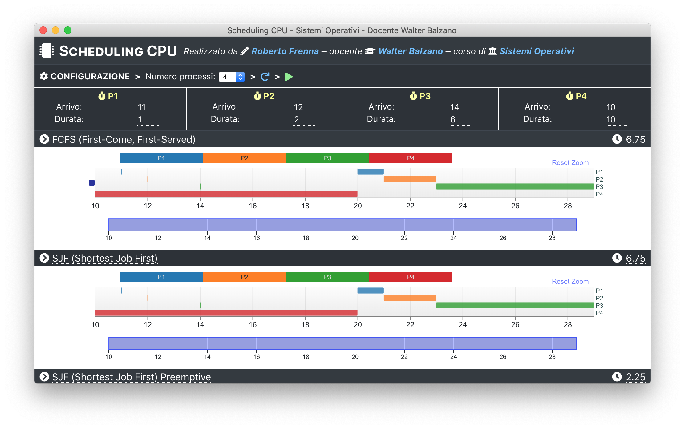

# CPU scheduling app - Electron edition



## Synopsis

This app allows to easily configure and plot processes using the following scheduling algorithms:

- [First-come, first-served (FCFS)](https://en.wikipedia.org/wiki/FIFO_\(computing_and_electronics\))
- [Shortest Job First (SJF, pre-emptive and non pre-emptive)](https://en.wikipedia.org/wiki/Shortest_job_next)
- [Round Robin](https://en.wikipedia.org/wiki/Round-robin_scheduling)

The codebase is modular and well-documented, more scheduling algorithms can be easily added.

**NOTE:** since this was an university project, the app is currently only in Italian.

Please checkout the [main code repository](https://github.com/Robertof/cpu-scheduling-src) and the
[web-app](https://github.com/Robertof/cpu-scheduling-web).

## Building and packaging

``` bash
# install dependencies
yarn

# run for development
yarn run dev

# build for production
yarn run build
```

## Credits

Icon made by <a href="https://www.flaticon.com/authors/prosymbols" title="Prosymbols">Prosymbols</a> from <a href="https://www.flaticon.com/" title="Flaticon">www.flaticon.com</a> is licensed by <a href="http://creativecommons.org/licenses/by/3.0/" title="Creative Commons BY 3.0" target="_blank">CC 3.0 BY</a>.
